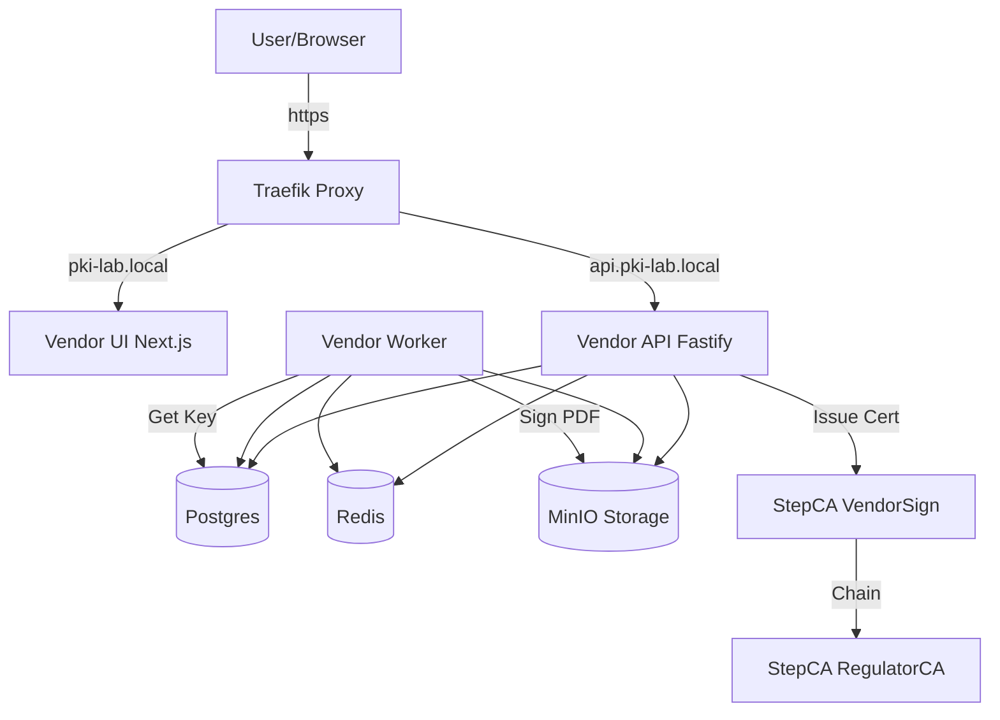

# TTE Lab PKI (Simulasi Tanda Tangan Elektronik)

Proyek ini adalah simulasi Laboratorium Infrastruktur Kunci Publik (PKI) untuk Tanda Tangan Elektronik (TTE).
Terdiri dari Root CA (Regulator), Intermediate CA (VendorSign), dan platform aplikasi untuk registrasi (KYC), penerbitan sertifikat digital, dan penandatanganan dokumen PDF.

---

## 🏗️ Arsitektur



## 🚀 Cara Menjalankan

### Prasyarat
- **Docker** & **Docker Compose**
- **Git**
- **Unix Shell** (Bash/Zsh) atau **PowerShell** (Windows)

### 1. Persiapan & Bootstrap (Wajib Berurutan)
Lakukan langkah ini untuk inisialisasi sertifikat CA dan konfigurasi awal.

**Linux / Mac:**
```bash
# Clone repo & masuk direktori
git clone https://github.com/tte-lab-pki/tte-lab-pki.git
cd tte-lab-pki

# Setup Environment
cp .env.example .env

# Masuk folder scripts dan jalankan urut
cd scripts

# 1. Cek lingkungan
./00_check.sh

# 2. Init Root CA (Regulator)
./10_bootstrap_root.sh

# 3. Init Vendor CA (VendorSign) dan Sign dengan Root
./20_bootstrap_vendor_intermediate.sh
```

**Windows (PowerShell):**
```powershell
# Clone repo & masuk direktori
git clone https://github.com/tte-lab-pki/tte-lab-pki.git
cd tte-lab-pki

# Setup Environment
Copy-Item .env.example .env

# Masuk folder scripts
cd scripts

# 1. Init Root CA (Regulator)
powershell -ExecutionPolicy Bypass -File .\10_bootstrap_root.ps1

# 2. Init Vendor CA (VendorSign)
powershell -ExecutionPolicy Bypass -File .\20_bootstrap_vendor_intermediate.ps1
```

### 2. Jalankan Service
Setelah bootstrap CA selesai, nyalakan seluruh service aplikasi.

```bash
cd .. # Kembali ke root folder
docker compose up -d --build
```
*Tunggu 1-2 menit hingga semua container (terutama `postgres` dan `api`) siap.*

### 3. Seed User & Data Awal
Script ini akan membuat user demo (`admin`, `clienta`, `clientb`) dan melakukan verifikasi awal.

**Linux / Mac:**
```bash
cd scripts
./30_seed_demo_users.sh
```

**Windows:**
```powershell
cd scripts
powershell -ExecutionPolicy Bypass -File .\30_seed_demo_users.ps1
```

### 4. Setup Host Lokal
Agar domain lokal terbaca, tambahkan entri berikut ke file hosts komputer Anda:

**Linux / Mac (`/etc/hosts`):**
```
127.0.0.1 pki-lab.local api.pki-lab.local
```

**Windows (`C:\Windows\System32\drivers\etc\hosts`):**
*(Buka Notepad sebagai Administrator)*
```
127.0.0.1 pki-lab.local api.pki-lab.local
```

---

## 🧪 Cara Penggunaan (Demo)

Buka **http://pki-lab.local** di browser.

### Akun Demo
- **Admin**: `admin@vendorsign.local` / `password123`
- **User A**: `clienta@lab.local` / `password`
- **User B**: `clientb@lab.local` / `password`

### Skenario Demo: Tanda Tangan & Sharing

1.  **Login sebagai User A** (`clienta@lab.local`).
2.  **Setup Tanda Tangan**:
    - Klik **"Manage Signature"**.
    - Gambar tanda tangan atau upload gambar.
    - Klik **"Save Signature"**.
    - *Sistem otomatis menerbitkan sertifikat digital untuk User A.*.
3.  **Upload Dokumen**:
    - Klik **"Upload Document"** dan pilih file PDF.
4.  **Tanda Tangan Dokumen**:
    - Klik tombol **"Sign"** pada dokumen.
    - Tentukan posisi tanda tangan (Halaman, X, Y, dll) di backend atau gunakan default (Visual Sign).
    - Status berubah menjadi **SIGNED**.
5.  **Share ke User B**:
    - Klik **"Share"**, masukkan email `clientb@lab.local`.
6.  **Login sebagai User B** (Gunakan Incognito atau logout User A).
7.  **Setup Tanda Tangan User B**:
    - **PENTING**: User B juga harus melakukan **"Manage Signature"** -> **"Save"** agar memiliki sertifikat. **Jika tidak, signing akan gagal.**
8.  **Sign Dokumen Shared**:
    - User B akan melihat dokumen yang dishare oleh User A.
    - Klik **"Sign"**. Dokumen akan memiliki dua tanda tangan.
9.  **Download**:
    - Klik **"Download"** untuk mengunduh PDF akhir.
    - Buka di Adobe Reader untuk melihat validitas signature.

---

## ⚠️ Troubleshooting

**1. "Failed to queue signing: No active certificate found"**
- **Sebab**: User belum memiliki sertifikat digital.
- **Solusi**: Buka menu **"Manage Signature"**, lalu klik **"Save Signature"**. Pastikan muncul notifikasi "Certificate issued". Meskipun gambar tanda tangan sudah ada, anda perlu klik Save lagi untuk memicu pembuatan sertifikat jika sebelumnya gagal/belum ada.

**2. "Download failed: Unauthorized"**
- **Sebab**: Token sesi tidak valid atau refresh halaman diperlukan. (Sudah diperbaiki di versi terbaru dengan secure fetch).
- **Solusi**: Reload halaman dan login ulang.

**3. Error saat Bootstrap (Windows)**
- **Sebab**: Execution Policy PowerShell memblokir script.
- **Solusi**: Gunakan `powershell -ExecutionPolicy Bypass -File <nama_file>`.

**4. API 404 / Cannot connect**
- **Sebab**: `vendor-api` belum ready atau masalah jaringan docker.
- **Solusi**: Cek logs `docker logs vendor-api`. Pastikan `vendor-api` running dan terhubung ke DB.

## 🛠️ Tech Stack
- **CA**: Smallstep `step-ca` (Regulator & Vendor Intermediate)
- **Backend Service**: Node.js 20, Fastify, Prisma ORM, TypeScript
- **Frontend**: Next.js 14, React
- **Storage**: MinIO (S3 Compatible), PostgreSQL 16, Redis 7
- **Infra**: Docker Compose, Traefik Reverse Proxy

Proyek ini adalah simulasi Laboratorium Infrastruktur Kunci Publik (PKI) untuk Tanda Tangan Elektronik (TTE) lokal.
Terdiri dari Root CA (Regulator), Intermediate CA (VendorSign), dan platform aplikasi untuk registrasi (KYC), penerbitan sertifikat digital, dan penandatanganan dokumen PDF.

---

## 🏗️ Arsitektur


## 🚀 Cara Menjalankan

### 1. Persiapan & Bootstrap (Wajib Berurutan)
Lakukan langkah ini untuk inisialisasi sertifikat dan konfigurasi sebelum menjalankan service.

```bash
# Clone repo ini (jika belum)
git clone https://github.com/tte-lab-pki/tte-lab-pki.git
cd tte-lab-pki
cp .env.example .env

cd scripts
# Cek lingkungan
./00_check.sh

# 1. Init Root CA (Regulator)
./10_bootstrap_root.sh

# 2. Init Vendor CA (VendorSign) dan Sign dengan Root
./20_bootstrap_vendor_intermediate.sh
```

### 2. Jalankan Service
Setelah bootstrap selesai, nyalakan seluruh service.

```bash
cd .. # Kembali ke root folder
docker compose up -d --build
```
*Tunggu beberapa menit agar semua container siap.*

### 3. Seed User
Setelah service (terutama API) up, jalankan seed script.

```bash
cd scripts
./30_seed_demo_users.sh
```


# 1. Bootstrap Ulang (Wajib berurutan)
powershell -ExecutionPolicy Bypass -File .\scripts\10_bootstrap_root.ps1
powershell -ExecutionPolicy Bypass -File .\scripts\20_bootstrap_vendor_intermediate.ps1

# 2. Nyalakan Service
docker compose up -d

# 3. Seed User (Tunggu service up dulu)
powershell -ExecutionPolicy Bypass -File .\scripts\30_seed_demo_users.ps1

# 3. Tunggu 10-20 detik, lalu jalankan Demo
powershell -ExecutionPolicy Bypass -File .\scripts\40_demo_curl.ps1
```,


### 3. Akses Aplikasi
Tambahkan entri berikut ke `/etc/hosts` (Linux/Mac) atau `C:\Windows\System32\drivers\etc\hosts` (Windows) agar domain lokal terbaca:
```
127.0.0.1 pki-lab.local api.pki-lab.local
```

Buka **http://pki-lab.local** di browser.

**Akun Demo:**
- **Admin**: `admin@vendorsign.local` / `password123`
- **User A**: `clienta@lab.local` / `password`
- **User B**: `clientb@lab.local` / `password`

## 🧪 Demo Flow (Step-by-Step)

### Cara Otomatis (CURL)
Gunakan script demo untuk menjalankan seluruh flow user story:
```bash
./scripts/40_demo_curl.sh
```
Script ini akan: Login Admin, Verifikasi User, Login User, Request Cert, Upload PDF, Sign PDF, Download PDF.

### Cara Manual (UI)
1. **Login User**: Masuk sebagai `clienta@lab.local` (Status awal: `PENDING`).
2. **Login Admin** (Incognito/Browser lain): Masuk sebagai `admin@vendorsign.local`.
   - Buka menu **Admin Console**.
   - Klik **Verify** pada Client A.
3. **Request Sertifikat**: Kembali ke User Dashboard.
   - Status berubah jadi `VERIFIED`.
   - Klik tombol **Request Certificate**. Serial Number akan muncul.
4. **Sign Dokumen**:
   - Upload file PDF (ada `samples/sample.pdf` jika butuh).
   - Di daftar dokumen, klik **Sign**.
   - Masukkan koordinat (Default contoh A4): `1,100,100,200,50` (Page, X, Y, W, H).
   - Tunggu status berubah jadi `SIGNED` (reload jika perlu).
   - Klik **Download**.
5. **Verifikasi**:
   - Buka PDF hasil download di Adobe Reader / Okular.
   - Akan ada tulisan visual "Digitally Signed by...".
   - Signature panel akan menunjukkan "Valid" (Jika Root CA di-trust di OS) atau "At least one signature has problems" (Jika Root CA belum di-trust, namun struktur kriptografi valid).

## ⚠️ Catatan Teknis & Batasan Lab

1. **PDF Signing**:
   - Lab ini menggunakan implementasi *Visual Appearance* + *Detached Signature* (PKCS#7) yang disimpan sebagai metadata.
   - Untuk simulasi, PDF hasil akhir memiliki stempel visual. Verifikasi kriptografi dilakukan dengan mencocokkan hash input vs signature di DB/Audit Log, atau menggunakan tool verifikasi eksternal terhadap nilai signature `sha256_signed` di database.
   - *Full PAdES embedding* yang kompatibel Adobe LTV memerlukan library komersial atau implementasi kompleks yang diluar cakupan "1-hour lab".

2. **Keamanan**:
   - Private Key user disimpan `base64` di database (simulasi enkripsi). Di produksi **wajib** menggunakan HSM atau KMS.
   - Password CA disimpan di file `secrets/`.
   - HTTPS user-facing tidak di-force (HTTP via Traefik) untuk kemudahan lab lokal.

3. **Status PENDING**:
   - Service menunggu `postgres` dan `step-ca` siap. Jika API `restarting`, tunggu sebentar karena dependency check.

## 🛠️ Tech Stack
- **CA**: Smallstep `step-ca`
- **Backend**: Node.js 20, Fastify, Prisma, TypeScript
- **Frontend**: Next.js 14, Vanilla CSS (Premium Dark Mode)
- **Infra**: Docker Compose, Traefik, PostgreSQL 16, Redis 7, MinIO
