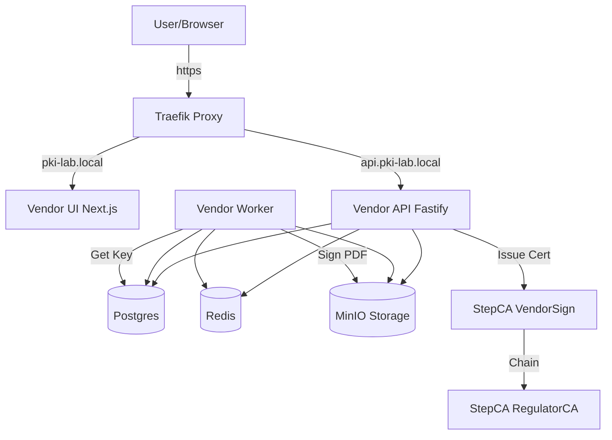

# TTE Lab PKI (Simulasi Tanda Tangan Elektronik)

Proyek ini adalah simulasi Laboratorium Infrastruktur Kunci Publik (PKI) untuk Tanda Tangan Elektronik (TTE) lokal.
Terdiri dari Root CA (Regulator), Intermediate CA (VendorSign), dan platform aplikasi untuk registrasi (KYC), penerbitan sertifikat digital, dan penandatanganan dokumen PDF.

---

## 🏗️ Arsitektur



## 🚀 Cara Menjalankan

### 1. Persiapan
Pastikan Docker dan Docker Compose sudah terinstall.

```bash
# Clone repo ini (jika belum)
git clone https://github.com/tte-lab-pki/tte-lab-pki.git
cd tte-lab-pki

# Setup Environment
cp .env.example .env

# Jalankan Service
docker compose up -d --build
```
*Tunggu beberapa menit agar semua container build dan service siap (terutama Postgres dan StepCA).*

### 2. Bootstrap PKI (Wajib)
Jalankan script berikut secara berurutan untuk inisialisasi CA dan User.

```bash
cd scripts
# Cek lingkungan
./00_check.sh

# 1. Init Root CA (Regulator)
./10_bootstrap_root.sh

# 2. Init Vendor CA (VendorSign) dan Sign dengan Root
./20_bootstrap_vendor_intermediate.sh

# 3. Seed User & Admin
./30_seed_demo_users.sh
```


# 1. Bootstrap Ulang (Wajib berurutan)
powershell -ExecutionPolicy Bypass -File .\scripts\10_bootstrap_root.ps1
powershell -ExecutionPolicy Bypass -File .\scripts\20_bootstrap_vendor_intermediate.ps1
powershell -ExecutionPolicy Bypass -File .\scripts\30_seed_demo_users.ps1

# 2. Nyalakan Service
docker compose up -d

# 3. Tunggu 10-20 detik, lalu jalankan Demo
powershell -ExecutionPolicy Bypass -File .\scripts\40_demo_curl.ps1
```,


### 3. Akses Aplikasi
Tambahkan entri berikut ke `/etc/hosts` (Linux/Mac) atau `C:\Windows\System32\drivers\etc\hosts` (Windows) agar domain lokal terbaca:
```
127.0.0.1 pki-lab.local api.pki-lab.local
```

Buka **http://pki-lab.local** di browser.

**Akun Demo:**
- **Admin**: `admin@vendorsign.local` / `admin`
- **User A**: `clienta@lab.local` / `password`
- **User B**: `clientb@lab.local` / `password`

## 🧪 Demo Flow (Step-by-Step)

### Cara Otomatis (CURL)
Gunakan script demo untuk menjalankan seluruh flow user story:
```bash
./scripts/40_demo_curl.sh
```
Script ini akan: Login Admin, Verifikasi User, Login User, Request Cert, Upload PDF, Sign PDF, Download PDF.

### Cara Manual (UI)
1. **Login User**: Masuk sebagai `clienta@lab.local` (Status awal: `PENDING`).
2. **Login Admin** (Incognito/Browser lain): Masuk sebagai `admin@vendorsign.local`.
   - Buka menu **Admin Console**.
   - Klik **Verify** pada Client A.
3. **Request Sertifikat**: Kembali ke User Dashboard.
   - Status berubah jadi `VERIFIED`.
   - Klik tombol **Request Certificate**. Serial Number akan muncul.
4. **Sign Dokumen**:
   - Upload file PDF (ada `samples/sample.pdf` jika butuh).
   - Di daftar dokumen, klik **Sign**.
   - Masukkan koordinat (Default contoh A4): `1,100,100,200,50` (Page, X, Y, W, H).
   - Tunggu status berubah jadi `SIGNED` (reload jika perlu).
   - Klik **Download**.
5. **Verifikasi**:
   - Buka PDF hasil download di Adobe Reader / Okular.
   - Akan ada tulisan visual "Digitally Signed by...".
   - Signature panel akan menunjukkan "Valid" (Jika Root CA di-trust di OS) atau "At least one signature has problems" (Jika Root CA belum di-trust, namun struktur kriptografi valid).

## ⚠️ Catatan Teknis & Batasan Lab

1. **PDF Signing**:
   - Lab ini menggunakan implementasi *Visual Appearance* + *Detached Signature* (PKCS#7) yang disimpan sebagai metadata.
   - Untuk simulasi, PDF hasil akhir memiliki stempel visual. Verifikasi kriptografi dilakukan dengan mencocokkan hash input vs signature di DB/Audit Log, atau menggunakan tool verifikasi eksternal terhadap nilai signature `sha256_signed` di database.
   - *Full PAdES embedding* yang kompatibel Adobe LTV memerlukan library komersial atau implementasi kompleks yang diluar cakupan "1-hour lab".

2. **Keamanan**:
   - Private Key user disimpan `base64` di database (simulasi enkripsi). Di produksi **wajib** menggunakan HSM atau KMS.
   - Password CA disimpan di file `secrets/`.
   - HTTPS user-facing tidak di-force (HTTP via Traefik) untuk kemudahan lab lokal.

3. **Status PENDING**:
   - Service menunggu `postgres` dan `step-ca` siap. Jika API `restarting`, tunggu sebentar karena dependency check.

## 🛠️ Tech Stack
- **CA**: Smallstep `step-ca`
- **Backend**: Node.js 20, Fastify, Prisma, TypeScript
- **Frontend**: Next.js 14, Vanilla CSS (Premium Dark Mode)
- **Infra**: Docker Compose, Traefik, PostgreSQL 16, Redis 7, MinIO
